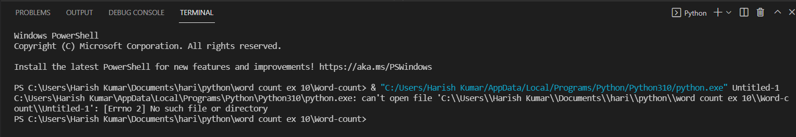
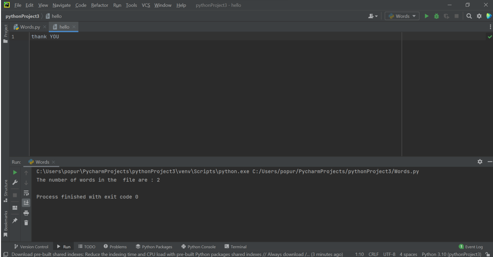

# Word-count
## AIM:
To write a python program for getting the word count from a text file.
## EQUIPEMENT'S REQUIRED: 
PC
Anaconda - Python 3.7
## ALGORITHM: 
### Step 1:
Start
## Step 2:
Declare a variable count equal to 0.
## Step 3:
Open the required text file in read mode as text.(any name can be
used).
## Step 4:
Loop until variable i in file text.
## Step 5:
Declare variable word = i.split().
## Step 6:
Process count+=len(word)End loop
## Step 7:
Print the value of count, 

## PROGRAM:
~~~
## Name :S.Harish Kumar.
## register no:21002965 
num_of_words = 0
file = open('wordtext.txt')
wordtext = file.read()
words = wordtext.split()
num_of_words = len(words)
print("Number of words = ",num_of_words)
~~~

### OUTPUT:

## RESULT:
Thus the program is written to find the word count from a text file.
