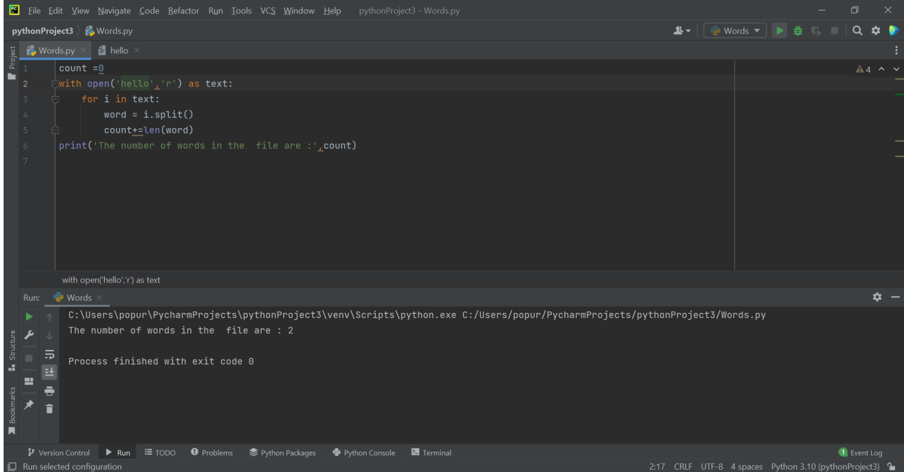

# Word-count
## AIM:
To write a python program for getting the word count from a text file.
## EQUIPEMENT'S REQUIRED: 
PC
Anaconda - Python 3.7
## ALGORITHM: 
### Step 1:
opening a file

## PROGRAM:
~~~
## Name :S.Harish Kumar.
## register no:21002965 
num_of_words = 0
file = open('wordtext.txt')
wordtext = file.read()
words = wordtext.split()
num_of_words = len(words)
print("Number of words = ",num_of_words)
~~~

### OUTPUT:

## RESULT:
Thus the program is written to find the word count from a text file.
